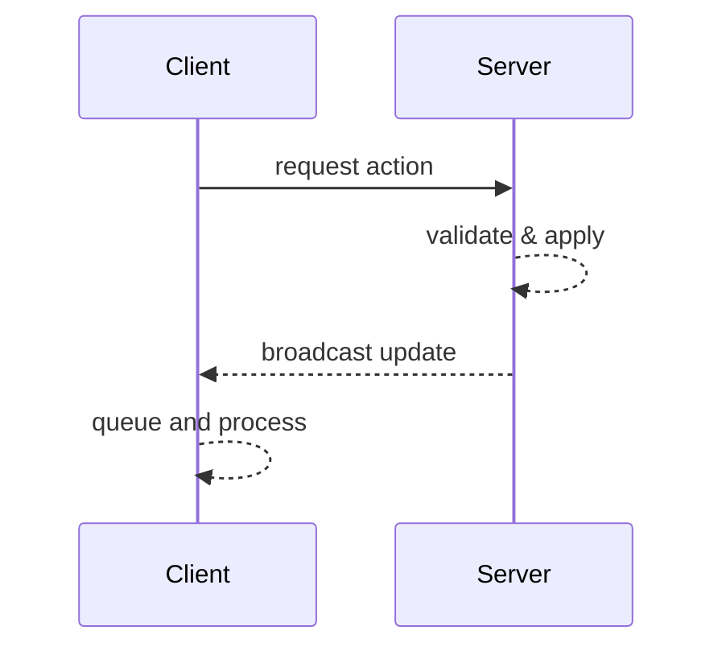

# Architecture

This document outlines the purpose of each Gradle module and how the game client and server interact.

## Module Responsibilities

### core
Shared ECS components, constants and cross-platform game logic. All serialization code lives here so the
client and server stay in sync.

### client
Desktop LibGDX client providing the rendering, UI and local input handling. It communicates with the server
for all world state changes.

### server
Headless game server that runs the same ECS systems as the client. It validates requests and broadcasts
state updates to all clients.

### tests
JUnit test utilities and scenario suites. The module boots LibGDX in headless mode so gameplay systems can be
tested without a graphical context.

## ECS Systems

`LogicWorldBuilder` assembles the update world. Input systems like
`CameraInputSystem`, `SelectionSystem` and `PlayerMovementSystem` handle user
actions, while `BuildPlacementSystem` and `PlayerFactory` create entities.
`TileUpdateSystem`, `BuildingUpdateSystem` and `ResourceUpdateSystem` apply
server messages. `ChunkLoadSystem` and `ChunkRequestQueueSystem` request missing
chunks. `MapWorldBuilder` builds the render world. `MapRenderSystem` draws the
world using a renderer from `SpriteMapRendererFactory`, which loads textures
asynchronously as noted in [performance.md](performance.md#asynchronous-renderer-loading).
`ParticleSystem` plays back `ParticleEffect` instances for events like building
placement. The camera is managed by `PlayerCameraSystem` and the UI by
`UISystem`.

`GameServer` does not maintain an Artemis world. It initializes an
`EventSystem` and relies on `NetworkService`, `MapService` and other services to
mutate the shared `MapState`. Kryonet handlers convert incoming messages into
commands processed by these services.

### Event Queue

`Events.dispatch` now queues events instead of sending them immediately. Each
call to `Events.update` processes up to ten queued events, forwarding them to the
underlying Artemis `EventSystem` and any listeners.

### Client ↔ Server Systems

| Client System | Client File | Server Handler | Server File | Purpose |
|---------------|------------|---------------|------------|---------|
| `TileUpdateSystem` | `client/.../TileUpdateSystem.java` | `TileSelectionRequestHandler` | `server/.../TileSelectionRequestHandler.java` | Tile selection updates |
| `BuildingUpdateSystem` | `client/.../BuildingUpdateSystem.java` | `BuildingPlacementRequestHandler`, `BuildingRemovalRequestHandler` | `server/.../BuildingPlacementRequestHandler.java`, `server/.../BuildingRemovalRequestHandler.java` | Building placement and removal |
| `ResourceUpdateSystem` | `client/.../ResourceUpdateSystem.java` | `ResourceGatherRequestHandler` | `server/.../ResourceGatherRequestHandler.java` | Resource changes |
| `ChunkRequestQueueSystem` | `client/.../ChunkRequestQueueSystem.java` | `MapChunkRequestHandler` | `server/.../MapChunkRequestHandler.java` | Map chunk loading |

Responses are queued on the client and processed by these systems during the
normal update loop.

## Networking Workflow
Client driven actions that modify the game world follow this sequence:

1. The client sends a request message to the server describing the action.
2. The server processes the request and broadcasts the resulting state change to all clients.
3. Clients queue incoming updates and apply them in a system during their normal update loop.

No local changes should be applied until the server response is processed so that every client remains
synchronized.

For a detailed walkthrough see [networking.md](networking.md).

## Building Costs

The server validates every placement request against the player's available
resources stored in `MapState.playerResources`. Each building type has a fixed
cost:

| Building | Cost |
|----------|------|
| House    | 1 wood |
| Market   | 5 wood, 2 stone |
| Factory  | 10 wood, 5 stone |

If the player lacks the required resources the request is ignored. When a
building is placed the server deducts the cost, updates `playerResources` and
broadcasts a `ResourceUpdateData` so clients stay in sync.

## Render Abstraction

Rendering code is decoupled from map creation through the `MapRendererFactory`
interface. `MapWorldBuilder` accepts a factory instance when building the render
world and defaults to a sprite batch based implementation. The active factory
can be configured via the `graphics.renderer` setting.
Optional GLSL effects can be added through shader plugins as explained in
[shaders.md](shaders.md).

`MapRenderData` acts as a lightweight view of the map state for renderers. A
`MapRenderDataSystem` converts the ECS `MapComponent` into immutable
`RenderTile` and `RenderBuilding` objects so renderers never depend on gameplay
components. Implementations simply need to fulfill the `MapRenderer` interface
against this data.

## Future Platform Goals
The project aims to evolve into a flexible simulation framework inspired by open-source games such as
[Mindustry](https://github.com/Anuken/Mindustry) and
[Unciv](https://github.com/yairm210/Unciv). Their mod-friendly approaches and wide platform support serve as
a model for extending Colony beyond the desktop environment.
