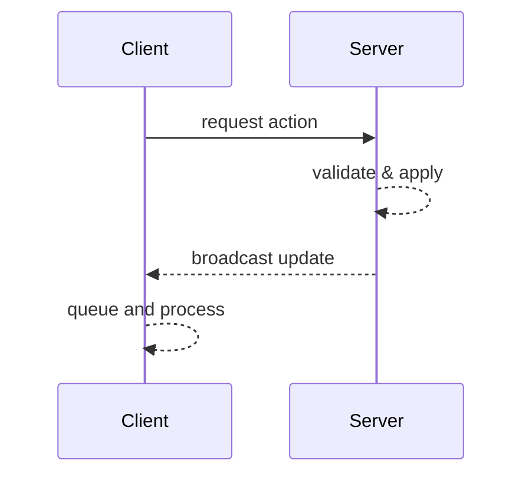

# Architecture

This document outlines the purpose of each Gradle module and how the game client and server interact.

## Module Responsibilities

### core
Shared ECS components, constants and cross-platform game logic. All serialization code lives here so the
client and server stay in sync.

### client
Desktop LibGDX client providing the rendering, UI and local input handling. It communicates with the server
for all world state changes.

### server
Headless game server that runs the same ECS systems as the client. It validates requests and broadcasts
state updates to all clients.

### tests
JUnit test utilities and scenario suites. The module boots LibGDX in headless mode so gameplay systems can be
tested without a graphical context.

## Networking Workflow
Client driven actions that modify the game world follow this sequence:

1. The client sends a request message to the server describing the action.
2. The server processes the request and broadcasts the resulting state change to all clients.
3. Clients queue incoming updates and apply them in a system during their normal update loop.

No local changes should be applied until the server response is processed so that every client remains
synchronized.

For a detailed walkthrough see [networking.md](networking.md).

## Render Abstraction

Rendering code is decoupled from map creation through the `MapRendererFactory`
interface. `MapWorldBuilder` accepts a factory instance when building the world
and defaults to a sprite batch based implementation. Alternative renderers, such
as the prototype 3‑D renderer, can be plugged in by providing a different
factory when calling `MapWorldBuilder.build`. The chosen renderer also determines
which camera system is registered. When a `ModelBatchMapRendererFactory` is
selected a perspective camera system is used, otherwise the default
`PlayerCameraSystem` provides an orthographic view.
The active factory can be configured via the `graphics.renderer` setting with
values `sprite` or `model`.

`MapRenderData` acts as a lightweight view of the map state for renderers. A
`MapRenderDataSystem` converts the ECS `MapComponent` into immutable
`RenderTile` and `RenderBuilding` objects so renderers never depend on gameplay
components. Swapping in a 3‑D renderer simply requires implementing the
`MapRenderer` interface against this data.

## Future Platform Goals
The project aims to evolve into a flexible simulation framework inspired by open-source games such as
[Mindustry](https://github.com/Anuken/Mindustry) and
[Unciv](https://github.com/yairm210/Unciv). Their mod-friendly approaches and wide platform support serve as
a model for extending Colony beyond the desktop environment.
