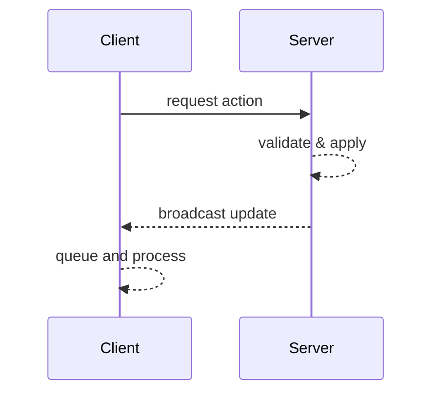

# Networking Guide

This guide explains how the `GameServer` and `GameClient` classes exchange messages and maintain a consistent world state.

## Client ↔ Server Flow



Clients never apply world changes until the corresponding update arrives from the server.

## Usage Examples

### Starting a Server

```java
GameServerConfig config = GameServerConfig.builder()
        .saveName("save")
        .mapGenerator(new MapGenerator())
        .build();

try (GameServer server = new GameServer(config)) {
    server.start();
}
```

### Connecting a Client

```java
GameClient client = new GameClient();
client.start(state -> {
    // initial map state received
});
```

The client submits requests using methods such as `sendTileSelectionRequest`. Each update is later retrieved within an update system:

```java
TileSelectionData update = client.poll(TileSelectionData.class);
```

For additional details see [architecture.md](architecture.md).
