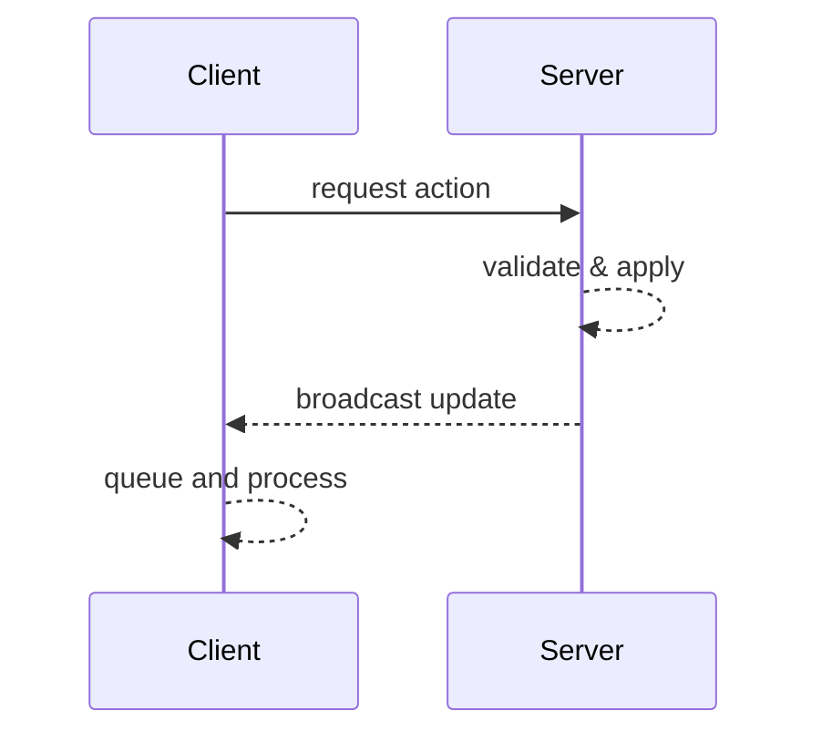

# Networking Guide

This guide explains how the `GameServer` and `GameClient` classes exchange messages and maintain a consistent world state.

## Client ↔ Server Flow



Clients never apply world changes until the corresponding update arrives from the server.

## Usage Examples

### Starting a Server

```java
GameServerConfig config = GameServerConfig.builder()
        .saveName("save")
        .mapGenerator(new MapGenerator())
        .build();

try (GameServer server = new GameServer(config)) {
    server.start();
}
```

### Connecting a Client

```java
GameClient client = new GameClient();
client.start(state -> {
    // initial map state received
});
```

### Handling Connection Errors

`GameClient` exposes an optional error callback for failed connections. Register
it before calling `start` to handle issues like the server not running:

```java
GameClient client = new GameClient();
client.setConnectionErrorCallback(ex -> System.err.println(ex.getMessage()));
client.start(state -> { /* loaded */ });
```

`Colony.startGame()` uses this callback to show an error screen when the client
cannot connect.

The client submits requests using methods such as `sendTileSelectionRequest`. Each update is later retrieved within an update system:

```java
TileSelectionData update = client.poll(TileSelectionData.class);
```

Map chunks are transmitted as GZIP-compressed Kryo streams to keep transfer
sizes small. The client decompresses each chunk before applying it to the map
state.

`MapMetadata` provides initial game information including the map width and
height. Clients use these dimensions to determine how many chunks to request
when loading a new game.

For additional details see [architecture.md](architecture.md).
